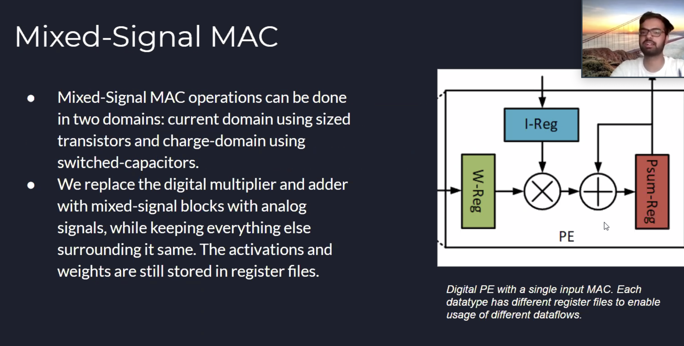
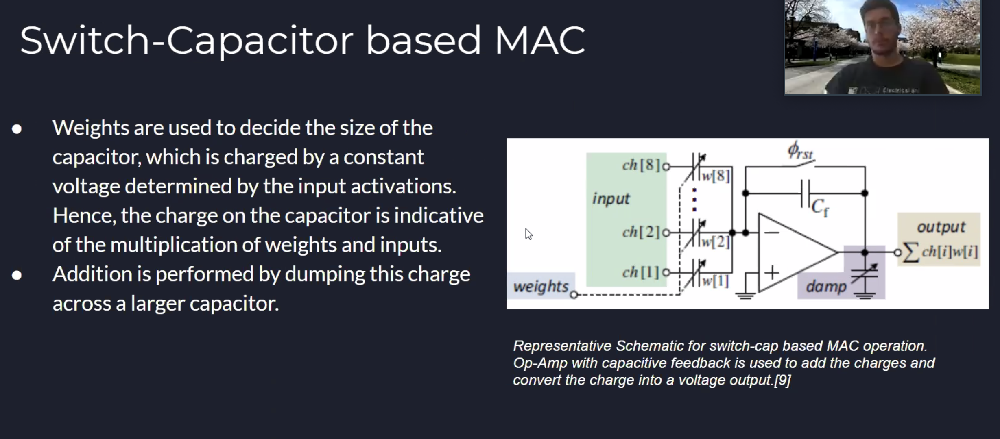
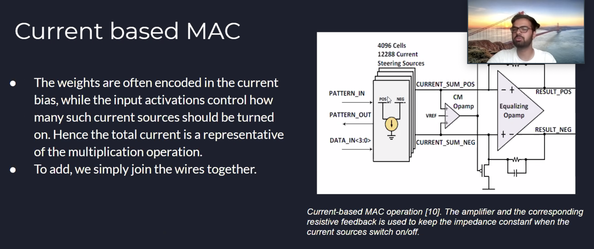

## Wednesday

**Meeting Questions**:

- What are my responsbilities for the next seven days?
  - **Read more into the memory channel exploit Peter briefly explained**.
  - 
- What is the meeting time for the Friday meetings?

**Meeting Notes:**

- Peter fixed more bugs with cache, and gem5 is pretty much running on his PC. There was some problems with the partition — but it’s now up to Prashant to compile SPEC for ARM and then have that built in into a disk image.

- The error is similar to the one we’ve seen in Week 28 Saturday (for when we try to run the other `fs.py` from config):

  ```
  [    0.228601] VFS: Cannot open root device "vfat" or unknown-block(0,0): error -6
  [    0.228645] Please append a correct "root=" boot option; here are the available partitions:
  [    0.228695] fe00         1048320 vda
  [    0.228697]  driver: virtio_blk
  [    0.228739]   fe01         1048288 vda1 00000000-01
  [    0.228740]
  [    0.228780] Kernel panic - not syncing: VFS: Unable to mount root fs on unknown-block(0,0)
  ```

Security paper from Prashant’s project:

- 30% complete
- There was some experiments that there are side channels in memory systems, where one process flood the memory and other process can see the 
- There are row buffers that offer lower latency, but this can be observed. 
- One process can slow down other process.
- Come up with a scheduling policy so that we don’t pay as much performance loss. 
- The state of art has either large performance loss compared to baseline (unsecure)
- We can treat everybody equally and that’s fine. 
- Have a small chance of leaking that information, but every so often re-randomize everything


Cache is a stateful side channel. Port contention and DRAM contention is more of a transient side channel — Peter suggest we need to look at how arbiter play a role.

---

http://www.cs.utexas.edu/~cart/parsec_m5/

---

**🤾🏻‍♂️ Between now and Friday:**

- Read the draft paper with a grain of salt.
- Look up re-randomization.

Try to understand the approaches with “how they do this rerandomization” (Caeser)???

### Paper Link

The link to the draft paper: https://www.overleaf.com/project/5eebbef24cb9ac00014aabf7

## Thursday

Slide 1:

- What is memory endurance

Slide 2:

- so MAC is a big part of the energy usage throughout the layers
- What was only 8.9% of the energy usage is now almost 50% of the total energy

Slide 3, 4:



Slide 5:



Slide 6:



## Friday

### Reading into Prashant’s Draft Paper on Memory Side Channel Vulnerabilities

- One question that comes up over and over again is what does it mean when a row-buffer is “open” or “closed”.
- I understand that since access to memory (DRAM) is relatively much slower, because of locality, instead of just “returning” one byte/word/dword of the address at a time, it is streamed to a row-buffer. Kind of like pre-fetching and caching, the performance is greatly increased if there is a **hit**.
- 