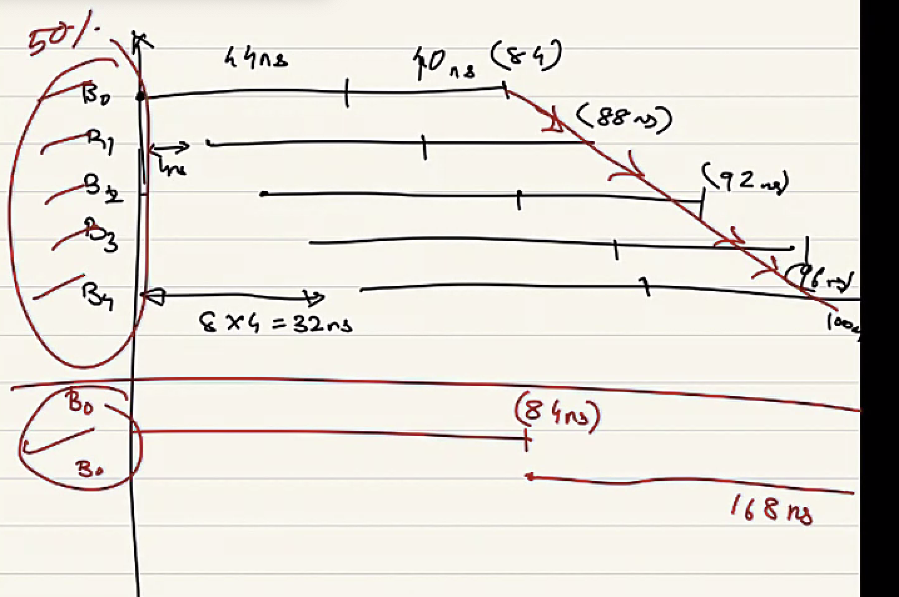

## Tuesday

Got the system to boot with Gem5, but nothing in the `m5out` directory for some reason. Calling the command `m5 checkpoint` seems to be setting a checkpoint — but I’m not sure where though.

```
**** REAL SIMULATION ****
warn: Existing EnergyCtrl, but no enabled DVFSHandler found.
info: Entering event queue @ 0.  Starting simulation...
warn: SCReg: Access to unknown device dcc0:site0:pos0:fn7:dev0
warn: Tried to read RealView I/O at offset 0x60 that doesn't exist
warn: Tried to read RealView I/O at offset 0x48 that doesn't exist
warn: Tried to write RVIO at offset 0xa8 (data 0) that doesn't exist
warn: Tried to write RVIO at offset 0xa8 (data 0) that doesn't exist
warn: Tried to write RVIO at offset 0xa8 (data 0) that doesn't exist
warn: Tried to write RVIO at offset 0xa8 (data 0) that doesn't exist
124938079500: system.terminal: attach terminal 0
warn: Tried to read RealView I/O at offset 0x8 that doesn't exist
warn: Tried to read RealView I/O at offset 0x48 that doesn't exist
Writing checkpoint
info: Entering event queue @ 31253161660270500.  Starting simulation...
Exiting @ tick 54931880714673500 because user interrupt received
```

To restore from checkpoint, we add the following option to the run script, where *N* is the enumeration of the checkpoint number for the simulation. (N=1 for the first checkpoint, 2 for second, etc.):

```
--checkpoint-restore=N
```

### Papers

#### De ́ja` View: Spatio-Temporal Compute Reuse for Energy-Efficient 360° VR Video Streaming

*Concepts to Learn:*

- **Memoization**: memoization is a strategy to make sure a function doesn’t compute for the same input twice by keeping a record of it in a hashmap or a table (the data type that stores it is called *memo*)
  - Simple example is recursive Fibbinacci sequence. Suppose the user calls `fib(3)` for the first time, then the function computes it.
  - Then suppose the user calls `fib(5)`, since we know that `fib(5)` is actually just `fib(4) + fib(3)` we can save computation by just look up the previously computed value for `fib(3)`.
  - **Difference from Caching**: *memoization* is almost like a subset of *caching* as it is a specific policy of caching that returns value of a function quickly based on the input, and whether or not input generates a hit/miss from the *memo*.
- **VR Data flow pipeline**: A 360deg video is encoded in rectangular format like all other video. A transformation matrix $\mathcal T^{R/L}$ is required to transform the 360 spherical video and map it to each eye, where $R$ is right and $L$ is left. The matrix $\mathcal T$ is then used to compute each frame. The input to compute $\mathcal T$ also depends on the IMU data from the headset, which is why it needs to be recomputed each frame.
- **PSNR**: *Peak Signal-to-Noise Ratio* is a measurement of the distortions and loss of quality. In this case, it’s more qualitative based on experimental data.

*Summary*:

There is an increasing amount of demand for VR content consumption — and with that, we need more energy optimized VR content streaming. In traditional 2D videos, most of the energy is lost to memory access. But in VR 360 video, the energy is mostly lost to computation because we need to compute translation matrices for each eye for each frame of the video.

The contribution saves energy by reducing the number of calculations needed by taking advantage of spatial and temporary locality: where the head orientations don’t move a lot over time (temporal) and the fact that the two eyes are closed together (spatial).

Since the head doesn’t turn a lot through various scenes of VR video. We can cache the computed transformation matrix by using *memoization* so that often times, the matrices can be reused. The IMU sensors for orientation tracking is quantized too without losing too much visual quality — the quantization is done so that memoization can work well without needing too much memory on the headset.

For cases when the temporal locatiy isn’t available and the matrices for left and right eye can’t be reused, the AE optimization kicks in and attempts to detemine the translation matrix of one eye based on the other eye (addition vs. Full matrix multiplications of five different transforms). This can be done by evaluating the first row of pixels of left and right eye, and finding the distance between the two mappings. Then apply it to the remaining frame.

The result is a 34% computation reduction if both methods are used, and 17% in energy savings.

*Thoughts*:

- While could be useful, does this mean that this only applies to video streaming. The article mentioned how VR/AR is important because of the interaction aspect of it. The study did not evaluate the usecases of interative environment such as VR paint/VR games where responsiveness is a lot more critical (then again, energy saving was never a factor relevant to gaming).
- To add on to this, the videos showcased are typically 30fps. With more market and demand for VR video — we could see rise of 60fps or 120/140fps high-refresh rate video. This means that the number of computations would be increased drastically (the article did not mention the refresh rate of the display of the HMD).

## Wednesday

**Meeting**:

- Copied the disk image with SPEC2006 for performance evaluations
- We should start with bare miniumum OS

---

**Meeting (Prashant’s project)**

- https://docs.google.com/document/d/1-jgDGI5F_WNIsiLDMO4GQOGEDtU4vg7TLseWywxTxK8/edit#heading=h.1rzvg8w2c8b8

- Understand **random address layout**, **row buffer in DRAM**, 

- 

  FS is completely secure.

- 

  The two extreme cases of memory access. 

  - Top: is when all sequential access are to different banks, so rows can be opened and closed in parallel.
  - Bottom: (fixed-service) is worst case scenario when requests all go to the same bank.

- **Birthday Paradox**?

## Thursday

- Learning about Memory from https://compas.cs.stonybrook.edu/~nhonarmand/courses/sp15/cse502/slides/06-main_mem.pdf.

## Sunday

**Ideas about the Presentation**:

- VR/AR users are growing — it is useful in many fields (especially for therapy reasons during COVID-19 pandemic with lockdowns and quarantines).
- The paper suggests thtat  only rotational and not translational data is relevant. Considering translational offset for applications such as gaming or other interactive applications would cause more complexity.
- (Side thought) this is relevant to the new AirPod Spatial Audio™, where user head orientation is important for a specific task — but it is also important to consider energy consumption due to its portable nature. The Spacial Audio example uses similar techniques compared to VR video rendering such that user head orientation is acquired from IMU/accelerometer/gyroscope sensors and then used to compute a projection matrix which alters the properties (volume) of the sound channels to emulate surround sound.
- While the paper (“Energy efficient processing for VR”) focuses a lot on SAS (Semantic-Aware-Streaming), it only works sometimes and as a backup, must rely on hardware-accelerated-rendering (HAR) to reduce energy overhead for computation.